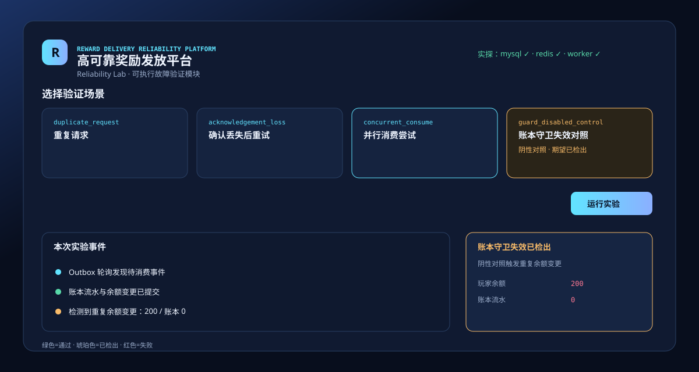

# Reward Delivery Reliability Lab

[](https://github.com/laixaviera17/reward-delivery-reliability-lab/actions/workflows/tests.yml)

> **面向测试开发 / 后端作品集**：本地实验台，验证游戏活动奖励在重复请求、Outbox 重试、并行轮询争用下，**余额副作用是否只发生一次**。



## 30 秒体验

```bash
make demo
# 或
docker compose up --build
```

1. 打开 `http://localhost:8000/dashboard`（地址末尾不要加中文句号）
2. **先跑**「账本守卫失效对照」→ 期望琥珀色 **已检出**（余额 200 / 账本 0）
3. **再跑**「并行消费尝试」→ 时间线应出现两个 Outbox 轮询 `task_id`、一次 `claim` 与一次未领取事件

## 唯一业务模型

```text
请求（幂等键）
  -> MySQL 事务：delivery_order + delivery_outbox_event（status=pending）
  -> Outbox 轮询任务以条件更新领取 pending 事件，经 Redis/Celery 执行副作用
  -> delivery_wallet_ledger（order_id 唯一）
  -> 玩家余额变更
  -> 断言订单、Outbox、账本、余额与状态
```

订单与 Outbox 在一个事务中创建。副作用不由实验编排器直接指定 `order_id`，而是由 **Outbox 轮询任务**以 `pending -> processing` 条件更新领取后再执行。账本 `order_id` 唯一约束仍是余额副作用边界；领取协议的取舍见 [ADR 0001](docs/adr/0001-outbox-claim-boundary.md)。

## 实验场景

| 场景 code | 中文名 | 验证点 | 预期结论 |
| --- | --- | --- | --- |
| `duplicate_request` | 重复请求 | 相同幂等键重复提交 | 只创建一张订单和一条 Outbox 事件 |
| `acknowledgement_loss` | 确认丢失后重试 | Outbox 轮询首次入账后模拟未确认，再次轮询 | 账本、余额仍各只有一次副作用 |
| `concurrent_consume` | 并行消费尝试 | 两个独立 Outbox 轮询任务争用同一 pending 事件 | 钱包不变量：账本 1、余额 100 |
| `guard_disabled_control` | 账本守卫失效对照 | 阴性对照：故意绕过账本直接改余额两次 | 断言检出重复变更（`detected`） |

`guard_disabled_control` 是 **阴性对照（negative control）**：证明「守卫失效时断言会响」，**不等于**能发现线上未知故障、配置漂移或真实重复投递。

## 项目边界（面试自述）

**验证：**

- 订单 + Outbox 同事务写入
- Outbox 条件领取 → 账本唯一约束 → 余额副作用边界
- 重复请求、确认丢失重试、并行轮询争用下的最终不变量
- 阴性对照能否在守卫被绕过时触发 `detected`

**不声称覆盖：**

- 生产级 Outbox 失败重投、死信队列、跨服调度
- 压测级并发稳定性（见 `make benchmark`）
- 真实游戏活动服接入与线上故障发现

## 运行

Docker 启动 MySQL、Redis、FastAPI、Celery Worker（`concurrency=4`）。并行场景提交 **两个独立 Outbox 轮询 Celery 任务**，完成后由 chord 回调做最终断言：

```bash
docker compose up --build
# 若曾使用旧库名 game_quality，请先：
docker compose down -v && docker compose up --build
```

页面右上角每 10 秒调用 `/health`（数据库 `SELECT 1`、Redis broker、Celery `control.ping`）。依赖不可用时显示红色，不是静态绿灯。

本地同步模式（SQLite，无 Celery）：

```bash
python3 -m venv .venv && source .venv/bin/activate
python3 -m pip install -r requirements.txt
python3 -m uvicorn app.main:app --reload
```

## 接口

| 接口 | 用途 |
| --- | --- |
| `GET /health` | 数据库、Redis、Worker 探活 |
| `GET /reliability/scenarios` | 可运行实验场景 |
| `POST /reliability/runs` | 创建实验（Docker 模式投递 Celery） |
| `GET /reliability/runs/{id}` | 事件时间线、断言、实际值 |
| `GET /reliability/trend` | 最近验证率与对照检出 |

## 测试

```bash
make test              # 单元测试（SQLite）
make test-integration  # MySQL + Redis + Celery chord（需 compose 已启动）
make benchmark         # 并行争用基准，输出 dedupe_detection_rate
```

- **单元测试**：SQLite 同步 Outbox 轮询，快速回归
- **集成测试**：与 Docker 演示同一条 Celery chord 路径
- **基准脚本**：统计天然竞态下的 dedupe 命中率，**不使用 SLEEP** 人为放大冲突

并发场景通过标准是**钱包不变量**（账本 1、余额 100），不是「必现两次消费尝试」。条件领取确保只有一个轮询拥有事件；另一个轮询会发现没有可领取的 pending 事件，这同样是通过。

## 术语（全文统一）

| 用 | 不用 |
| --- | --- |
| Outbox 轮询任务 | 线程 / 调度 / 直接消费 |
| 钱包不变量 | 永远全绿 |
| 阴性对照 `detected` | 质量保障体系 |
| Lab / 实验台 | Platform / 中台 |

## 仓库

[`reward-delivery-reliability-lab`](https://github.com/laixaviera17/reward-delivery-reliability-lab) · Docker 数据库 `reliability_lab`
