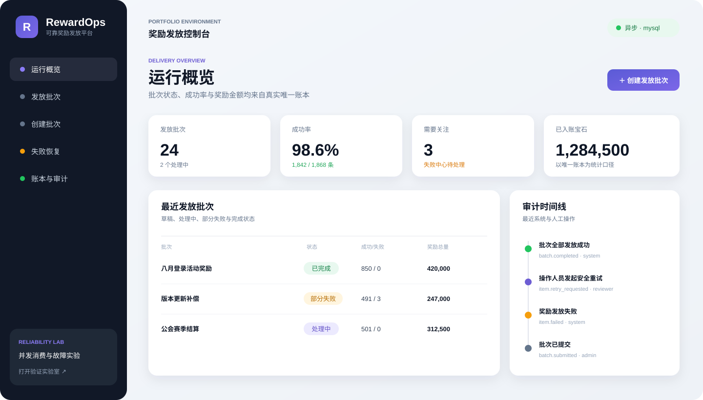
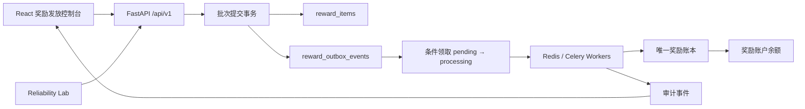

# Reward Delivery Reliability Platform

[](https://github.com/laixaviera17/reward-delivery-reliability-lab/actions/workflows/tests.yml)

> 面向游戏运营与企业激励场景的可靠奖励发放参考实现：提供可操作的批次发放闭环，并用事务 Outbox、条件领取、唯一账本、失败重试和故障实验验证重复请求与并发消费不会造成重复入账。



## 项目价值

奖励发放最难的部分不是“正常请求成功”，而是数据库已提交但消息未发出、消费者已入账但确认丢失、运营人员重复点击重试、多个 Worker 同时消费等异常边界。本项目把这些风险转化为可运行的业务流程和可检查的工程证据。

```text
运营创建批次 → 提交发放 → Outbox 异步投递 → 唯一账本入账
                                    ↓ 失败
                              失败中心安全重试
                                    ↓
                         账本结果 + 审计时间线
```

核心结论：在至少一次投递语义下，通过幂等消费实现业务效果上的 exactly-once。这里不是宣称消息系统提供端到端 Exactly Once。

## 5 分钟体验

```bash
cp .env.example .env
make demo
```

打开 `http://localhost:8000/app/`：

1. 进入“创建批次”，保留示例中的 `fail_once` 明细并保存草稿。
2. 在批次详情确认明细后提交发放；正常明细成功，故障明细进入失败中心。
3. 在“失败恢复”执行安全重试，观察失败数归零且批次转为完成。
4. 在“账本与审计”核对每个 `item_id` 仅有一条账本记录，并展开审计载荷。
5. 打开 `http://localhost:8000/dashboard`，运行并行消费、确认丢失和阴性对照实验。

Compose 默认将 Redis 发布到宿主机 `6380`，容器内部仍使用 `redis:6379`；可在 `.env` 中覆盖 `REDIS_HOST_PORT`。

仅使用 SQLite 的本地同步模式：

```bash
python3 -m venv .venv
source .venv/bin/activate
python3 -m pip install -r requirements-dev.txt
npm ci --prefix frontend
npm run build --prefix frontend
python3 -m uvicorn app.main:app --reload
```

同步模式不依赖 Redis 和 Worker，健康接口会把它们标记为 `not_required`。

## 业务闭环

| 阶段 | 可见能力 | 可靠性边界 |
| --- | --- | --- |
| 创建 | 批次与多条奖励明细先保存为草稿 | 校验发放对象、数量、重复对象和故障模式 |
| 提交 | 明细统一转为待处理并创建 Outbox | 状态机阻止重复提交 |
| 发放 | Celery Worker 异步处理每条明细 | 条件领取避免多个消费者同时持有任务 |
| 入账 | 更新账户余额并写奖励账本 | `reward_ledger.item_id` 唯一约束形成幂等边界 |
| 恢复 | 失败中心展示错误、Outbox 状态和尝试次数 | 复用原 item/Outbox，最多重试 3 次，不创建新业务身份 |
| 审计 | 展示创建、提交、失败、重试、成功和终态 | 操作人、事件类型、时间和 JSON 载荷持久化 |

## 架构



前端使用 React、TypeScript 和 Vite，页面、API client、类型与可复用组件分层；后端使用 FastAPI、SQLAlchemy、MySQL/SQLite、Redis 和 Celery。订单与 Outbox 的领取边界设计见 [ADR 0001](docs/adr/0001-outbox-claim-boundary.md)。

## 可验证业务不变量

- 一个批次内，同一发放对象只能出现一次。
- 同一奖励明细最多存在一条账本记录。
- 重复 Worker 派发和人工重试不会重复增加余额。
- 成功明细对应的 Outbox 最终为 `consumed`。
- 失败明细保留错误原因和尝试次数，超过阈值后拒绝继续重试。
- 批次终态由明细聚合得出，重复处理不会重复生成完成审计。
- Reliability Lab 的正常场景还要求一张订单、一条 Outbox、一笔账本及余额一致。

## 故障实验

| 场景 | 注入方式 | 预期证据 |
| --- | --- | --- |
| `duplicate_request` | 相同幂等键重复提交 | 一张订单、一条 Outbox、一笔账本 |
| `acknowledgement_loss` | 入账后模拟确认丢失并重新轮询 | 尝试次数增加，余额仍为 100 |
| `concurrent_consume` | 两个独立 Celery 轮询任务争用同一事件 | 只有一个任务领取，钱包不变量通过 |
| `guard_disabled_control` | 故意绕过账本直接增加两次余额 | 阴性对照被检出，证明断言具有检错能力 |

业务批次还提供 `none`、`fail_once` 和 `always_fail` 三种可控下游结果，用于演示恢复流程和最大重试限制。

## API v1

| 方法与路径 | 用途 |
| --- | --- |
| `GET /health` | 数据库、Redis、Worker 探活及执行模式 |
| `GET /api/v1/reward-stats` | 批次、成功率、失败数和账本金额汇总 |
| `POST /api/v1/reward-batches` | 创建奖励发放草稿 |
| `GET /api/v1/reward-batches` | 查询批次列表 |
| `GET /api/v1/reward-batches/{id}` | 查询明细、Outbox、余额和批次审计 |
| `POST /api/v1/reward-batches/{id}/submit` | 原子提交批次并异步派发 |
| `GET /api/v1/reward-items?status=failed` | 查询全局失败任务 |
| `POST /api/v1/reward-items/{id}/retry` | 对原业务身份执行受限安全重试 |
| `GET /api/v1/reward-ledger` | 查询唯一奖励账本 |
| `GET /api/v1/reward-audit-events` | 查询全局审计流 |
| `POST /api/v1/reliability/runs` | 创建可靠性故障实验 |
| `GET /api/v1/reliability/runs/{id}` | 查询实验时间线与不变量结果 |

所有参数错误和资源错误使用统一错误结构，并返回 `X-Request-ID`。旧版 `/reliability/*` 路由暂时保留兼容，新客户端使用 `/api/v1`。

## 测试与质量门禁

```bash
make check             # Ruff + mypy + Python 单测 + 80% 覆盖率门禁
make frontend-check    # ESLint + TypeScript + Vitest + 生产构建
make test-integration  # 真实 MySQL + Redis + Celery 集成测试
make benchmark         # 40 轮、8 路并发基准及报告生成
```

当前回归结果：

- Python：22 项非集成测试通过，覆盖率 85.23%。
- 前端：4 项 API/组件测试通过，ESLint、TypeScript 和 Vite production build 通过。
- 集成：2 项真实异步测试通过，包括同一业务批次重复派发仍只产生一次账本副作用。
- 黑盒：草稿、提交、首次失败、人工重试、账本与审计完整闭环通过，浏览器控制台无错误。

CI 分别执行 Python 静态检查与覆盖率门禁、前端 lint/typecheck/test/build，以及真实 MySQL、Redis、Celery 并发集成测试。

## 并发基准

本机 Docker 基准使用 8 路提交并发、4 个 Celery Worker 并发槽，每轮创建一张订单并让两个独立轮询任务争用同一 Outbox 事件。

| 指标 | 结果 |
| --- | ---: |
| 通过 / 失败 | 40 / 0 |
| 钱包不变量通过率 | 100% |
| 单一领取率 | 100% |
| 吞吐 | 12.36 runs/s |
| P50 / P95 / P99 | 625.42 / 762.87 / 767.82 ms |

完整方法、环境说明和原始样本见[并发压测报告](docs/performance/concurrent-benchmark.md)与[JSON 原始结果](docs/performance/concurrent-benchmark.json)。这是作品集规模的正确性/负载测量，不代表生产容量承诺。

## 运行模式

| 模式 | 数据库 | Redis/Celery | 用途 |
| --- | --- | --- | --- |
| `sync` | SQLite | 不需要 | 快速本地体验和单元测试 |
| `celery` | MySQL | 必需 | 真实异步发放、集成测试和并发验证 |

## 项目边界

当前版本是“最小奖励发放闭环 + 高可靠核心 + 可执行故障实验室”，适合展示后端可靠性、数据一致性、异步任务和前后端工程能力；它不是可直接上线的 HR 或财务系统。

尚未提供：

- 身份认证、RBAC、多租户与审批流。
- 财务对账、冲正、批量导入和渠道回执。
- 生产级 Outbox lease、指数退避、死信队列和归档。
- Prometheus 指标、分布式追踪、限流和容量规划。

请勿在补齐认证、授权和生产运维边界前暴露到不可信网络。安全报告方式见 [SECURITY.md](SECURITY.md)。

## 路线图

- P1 已完成：最小发放批次、失败恢复、唯一账本、审计可视化和正式 TypeScript 前端工程。
- P2 已完成：可复现的并发正确性/负载基准及原始 JSON 报告。
- 下一阶段：RBAC、审批、对账/冲正、指标与追踪；这些能力应在明确业务需求后独立演进。

## License

[MIT](LICENSE)
